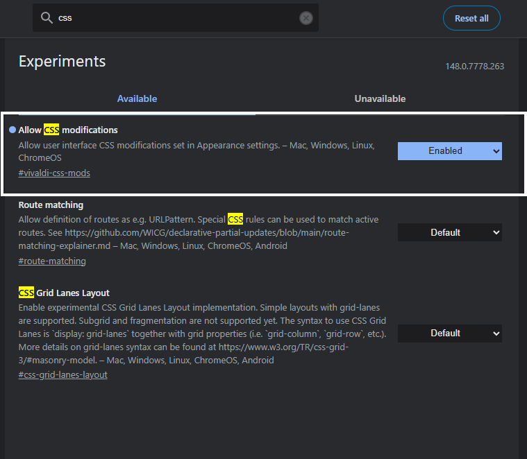
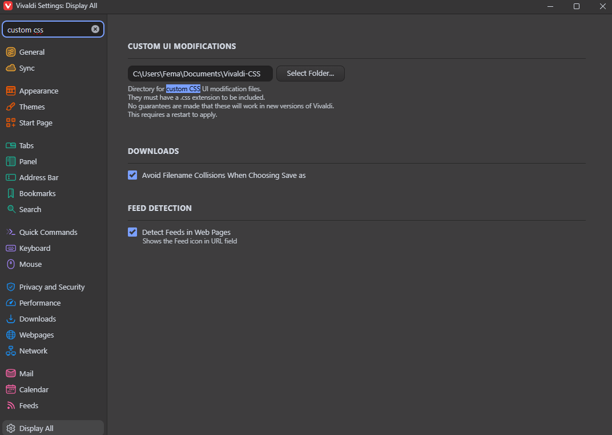
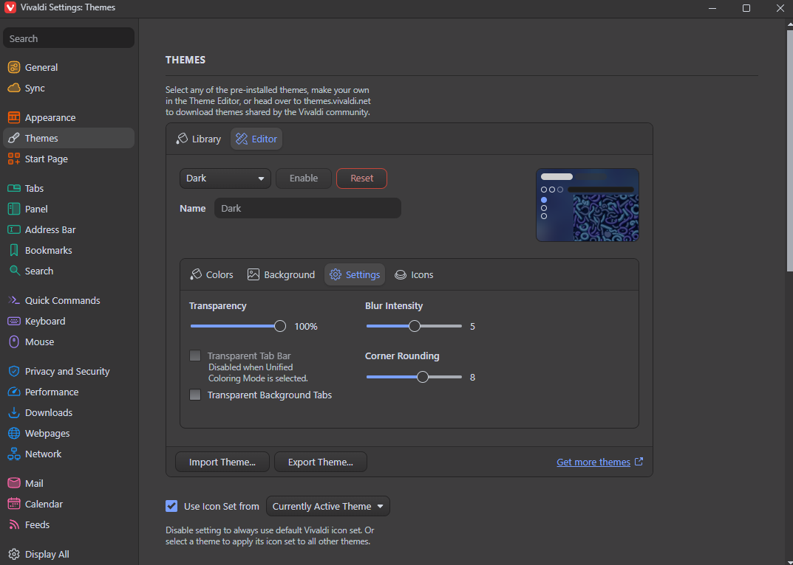
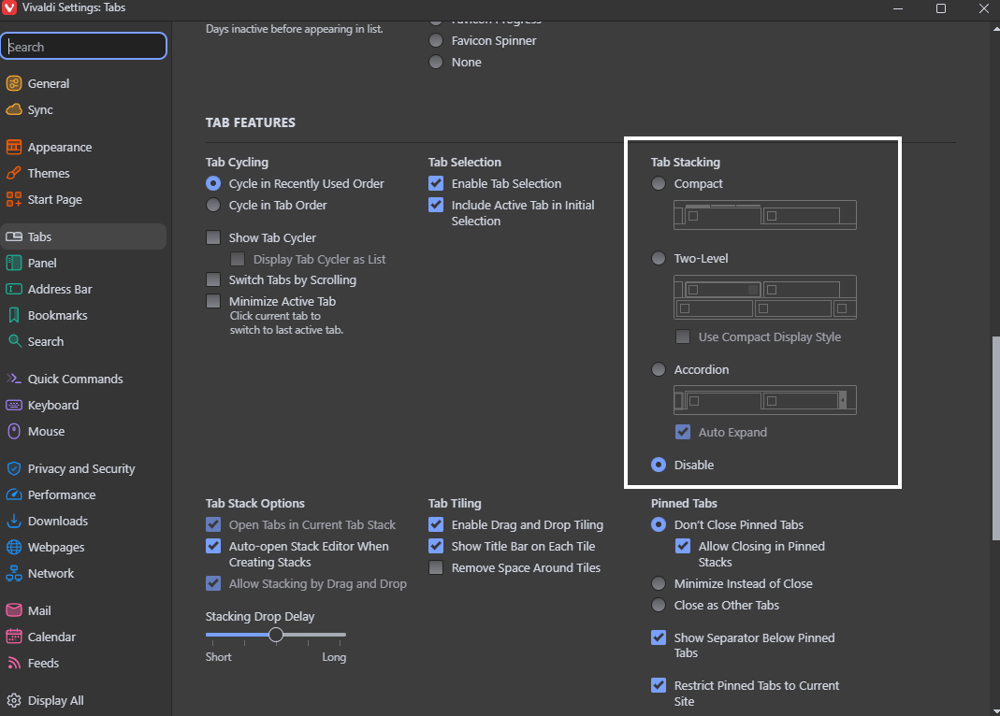

# Vivaldi Arc/Zen Style Custom CSS Installation Guide

This guide will help you install and configure the Arc/Zen style custom CSS for your Vivaldi browser.

## Step-by-Step Installation

### Step 1: Enable CSS Modifications in Experiments
1. Open Vivaldi and type `vivaldi://experiments` into the address bar, then press `Enter`.
2. Find the option **"Allow CSS modifications"**.
3. Check the box to **Enable** it.

### Step 2: Configure Vivaldi Appearance Settings
1. Open Vivaldi Settings by clicking the gear icon (⚙️) in the bottom left corner, or press `Ctrl + F12` (`Cmd + ,` on macOS).
2. Go to the **Appearance** tab (or search for "custom css" using the settings search bar).
3. Under the **CUSTOM UI MODIFICATIONS** section, click the **Select Folder...** button.
4. Choose the folder on your computer where you intend to store your custom `.css` files.
5. Place your custom `.css` files into the selected folder.

### Step 3: Theme Customization
Go to **Settings > Themes > Editor > Settings** to set the transparency, blur intensity, and corner rounding, as shown in the picture.

### Step 4: Tab Management
Go to **Settings > Tabs > Tab Features** to configure **Tab Stacking** to **Disabled**.

### Step 5: Restart
**Restart Vivaldi** for the changes to take effect.
