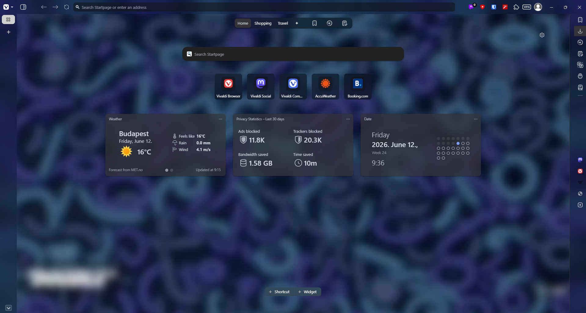

# ZenityArc-Vivaldi

> ✨ **Bring the minimalist aesthetics of Arc and Zen Browser into Vivaldi**

`ZenityArc-Vivaldi` is a custom CSS modification designed to strip away clutter and reshape Vivaldi into a modern, distraction-free environment. It features smooth corner rounding and elegant overlay sidebars that cleanly collapse and expand on hover.

## Step-by-Step Installation

### Step 1: Enable CSS Modifications in Experiments
1. Open Vivaldi and type `vivaldi://experiments` into the address bar, then press `Enter`.
2. Find the option **"Allow CSS modifications"**.
3. Check the box to **Enable** it.

### Step 2: Configure Vivaldi Appearance Settings
1. Open Vivaldi Settings (`Ctrl + F12` or `Cmd + ,` on macOS).
2. Go to the **Appearance** tab.
3. Under the **CUSTOM UI MODIFICATIONS** section, click **Select Folder...**.
4. Choose the folder where you want to keep your custom styles, and place your `vivalarc_v2_8.css` file inside it.

### Step 3: Theme Customization
Go to **Settings > Themes > Editor > Settings** to set the transparency, blur intensity, and corner rounding as shown in the picture to match the soft edges of Zen/Arc.

### Step 4: Tab Management
Go to **Settings > Tabs > Tab Features** and set **Tab Stacking** to **Disabled**.

### Step 5: Restart
**Restart Vivaldi** for the changes to take effect.